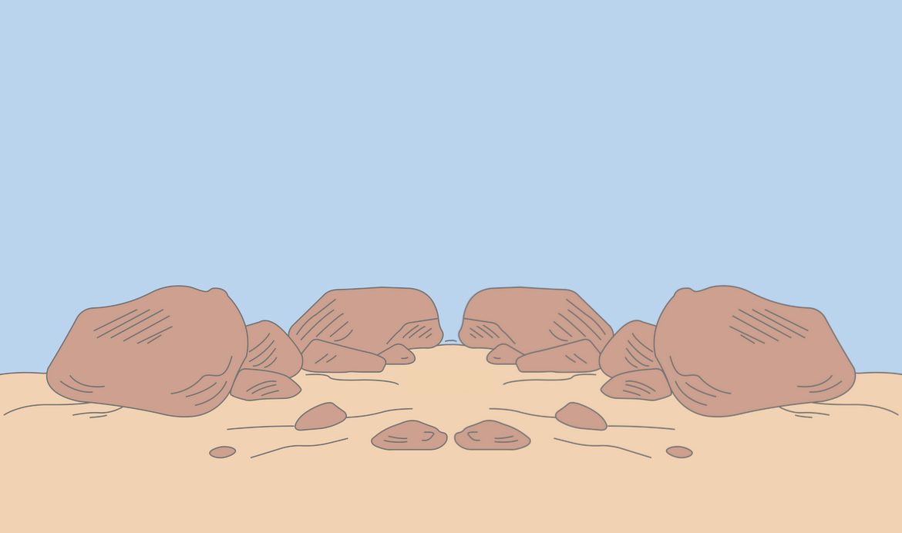
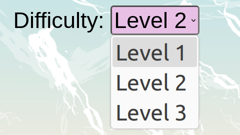

# Solid Foundation ReadMe
### Tower building game designed by Iona Tramelli and Jaylyn Henegar 
[Back To Main Page](../README.md)

## Table of Contents
| Main Section | Subsections | Subsubsections |
|--------------|--------------|---------------|
| [Overview](#overview) | | |
| [Overarching Design](#overarching-design) | <ul><li>[Responsive](#responsive)</li><li>[Page Layout](#page-layout)</li><li>[Background Designs](#background-designs)</li><li>[HTML Organization](#html-organization)</li><li>[CSS Organization](#css-organization)</li><li>[Classes and IDs](#classes-and-ids)</li><li>[Buttons and Select](#buttons-and-select)</li></ul> | |
| [Homepage](#homepage) | <ul><li>[Page Layout](#page-layout-1)</li><li>[Classes and IDs](#classes-and-ids-1)</li><li>[Important Design Specifics](#important-design-specifics)</li></ul> | Important Design Specifics: <ul><li>[Sizing](#sizing)</li><ul> |
| [Options Page](#options-page) | <ul><li>[Page Layout](#page-layout-2)</li><li>[Classes and IDs](#classes-and-ids-2)</li><li>[Important Design Specifics](#important-design-specifics-1)</li><li>[Scripts](#scripts)</li></ul> | Important Design Specifics: <ul><li>[Descriptions Font Design](#descriptions-font-design)</li><li>[Mode and Difficulty Selectors](#mode-and-difficulty-selectors)</ul> |
| [Game Page](#game-page) | <ul><li>[Dynamic Element Creation](#dynamic-element-creation)</li><li>[Page Layout](#page-layout-3)</li><li>[Classes and IDs](#classes-and-ids-3)</li><li>[Important Design Specifics](#important-design-specifics-2)</li><li>[Scripts](#scripts-1)</li></ul> | Important Design Specifics: <ul><li>[Psuedo Pop-up Windows](#psuedo-pop-up-windows)</li><li>[Overlays](#overlays)</li><li>[Mode Settings](#mode-settings)</li><li>[Scrolling](#scrolling)</li><li>[Gameplay Styling](#gameplay-styling)</li></ul> |

<br>
<br>

## Overview
&nbsp;&nbsp;&nbsp;&nbsp;This game is comprised of 3 total pages comprised of 3 HTML pages, 3 CSS pages and 5 Javascript pages.
- Homepage
    - Content from Homepage.html
    - Styling from Homepage.css
- Options page
    - Content from Options.html
    - Styling from Options.css
    - Functional using Main.js
- Game page
    - Content from Game.html
    - Styling from Game.css
    - Functional using:
        - Main.js
        - Setup.js
        - Modes.js
        - Gameplay.js
        - DragNDrop.js

&nbsp;&nbsp;&nbsp;&nbsp;As shown in the list above, each page has its own respective HTML page for its content and its own respective CSS page for styling, and all the pages but Homepage use Main.js to handle the storage and use of data on each page. They have Main.js included as drop-down selectors are used for the user to select their difficulty level and mode for the game. That file makes sure that the proper data is stored and loaded on each page based on what the user has done. The Homepage does not include that file because it does not add or use any data. It's purpose is to be a landing page to introduce the game. The other four Javascript files are used in the Game page as that is where the main game is played. 

&nbsp;&nbsp;&nbsp;&nbsp;In the section below the overarching design of all the HTML pages through the use of CSS will be described, and further sections will give specifics on each page of the application. From reading this document, you will learn about the design principles used throughout the project. This includes the page layout method used, responsive design, dynamically created elements, how the HTML and CSS pages were organized, how and why classes and IDs were used, the naming scheme used for the classes and IDS, what the most important parts of the CSS and HTML are, including what edits could potentially break the look and functionality of the game, and includes why scripts are called in the locations they are. If you want to read more on the functionality of the game itself and how data is handled, please refer to this [technical document](./TechnicalDoc.md) to learn more about the Javascript.

<br>
<br>

## Overarching Design
*Subsections: 
| [Responsive](#responsive) | [Page Layout](#page-layout) | [Background Designs](#background-designs) | [HTML Organization](#html-organization) | [CSS Organization](#css-organization) | [Classes and IDs](#classes-and-ids) | [Buttons and Select](#buttons-and-select) |*

### Responsive
&nbsp;&nbsp;&nbsp;&nbsp;All pages for this application have been created with responsive design in mind, designed with the idea of mobile first. To make the pages responsive, relative sizing is used for all elements on each page. This includes, but is not limited to height, width, font size, margin, and padding. The units used are em, rem, fr and percent. As this application is intended to be used on both mobile and desktop, the font size uses clamp(), a function which defines a maximum size, minimum size and the preferred size so that the font size will shrink and expand proportionally based upon the size of the screen. This makes the text readable on all screen sizes and keeps the font size from getting too large on mobile and too small on desktop. The clamp values were determined from a calculator from [utopia.fyi](https://utopia.fyi/type/calculator?c=240,16,1.2,1920,22,1.2,10,0,360&s=0.75|0.5|0.25,1.5|2|3|4|6,s-l&g=s,l,xl,12), which calculates clamp values based upon the minimum font and screen size, maximum font and screen size, and the step size between the levels of font size. The link above has all the sizes set to what is used in this application. 

### Page Layout
&nbsp;&nbsp;&nbsp;&nbsp;All pages are displayed using a combination of CSS grid and flexbox. The overall layout of the page is done through CSS grid, and the layout of the sections of the grid are done with flexbox if there are multiple elements inside of the grid section. As both grid and flexbox are being used, there are containers in the form of div tags in the html pages, each with a CSS class descriptive to what it is containing. The main div container, labeled with the class "container", is the first container that is shown and contains the entire grid, as well as organizes the grid sections and sizes. Within that main container, the containers that have that main container as their parent are containers for a section of the grid. They contain all elements that will be in a specific section of the grid. Any containers inside those containers are used to keep related elements together, and to help order the elements inside the grid section. 

Here is a simple example of how the containers are layered:
```html
<body>
    <div class=container>
        <div class=statisticsContainer>
            <div class=scoreTrackerContainer>
                <div class="scoreLabel" id="scoreLabel">Score:</div>
                <div class="scoreTracker" id="scoreTracker">
                    <div>0/8</div>
                </div>
            </div>
            <div class=timerContainer>
                
                <div class="timer" id="timer">00:00:00</div>
            </div>
        </div>
        <div class=wordBank>
            <div>This is a word bubble</div>
            <div>This is another word bubble</div>
            <div>This is one more word bubble</div>
        </div>
    </div>
</body>
```

### Background Designs
&nbsp;&nbsp;&nbsp;&nbsp;Each pages has a background design which is slightly different in appearance from each other but is set up in the same fashion. The background images are set up in a picture tag for the Homepage and Options page, and just set up in an img tag for the Game page. The Homepage and Options page use the same background image and have the background image set up in a picture tag because there are 3 different resolutions for the same picture. This lets the pages be more optomized for both smaller and larger screens. The Game page background image is different and only has one resolution, so just the img tag is used. The background image is the last element of the html in the body tag, unless there are any scripts that are called, in which case it is second to last.
```html
    ...
    <picture class="background">
        <source class="background" srcset="../Images/beach-5126180_640.png" media="(max-width: 640px)"/>
        <source class="background" srcset="../Images/beach-5126180_1280.png" media="(max-width: 1280px)"/>
        
    </picture>  
    <!--Any scripts called show up here-->
</body>
```
```html
    ... 
    
    <!--Any scripts called show up here-->
</body>
```
&nbsp;&nbsp;&nbsp;&nbsp;The design for the backgrounds are all the same aside from changes in the opacity and the actual background image. One important property that all the backgrounds have is their z-index set to -1, as that puts it in the backdrop. The CSS for the backgrounds can be found under .background at the bottom of the CSS stylesheet above any media queries. 
```css
/* BACKGROUND STYLING */
.background {
    position: fixed; /* This and two lines below fixes the background to have its upper left corner in the upper left of the screen */
    top: 0;
    left: 0;
    object-fit: cover;
    min-height: 100%;
    min-width: 100%;
    /* Opacity shows up here. Options page is filter: (opacity(65%) and Game page is opacity: 70%) */
    z-index: -1; /* Makes sure that the background image is behind all other elements */
}
```

### HTML Organization
&nbsp;&nbsp;&nbsp;&nbsp;All HTML pages are organized in the same fashion. The header contains the game title, link to its respective stylesheet, links to any Javascript files it uses, and the meta information for the character set and setting up the viewport. The body contains all the elements for the page wrapped in containers based on grid location. The only elements outside of the main grid container in the body are the overlays used in the Game page, the background images, and the scripts to be called to make the page work. Everything else is inside the main grid container either as a stand alone div or inside another div container. As the pages are styled using CSS grid, the order of the grid section containers are in order of what you would see on the displayed page, going from top to bottom in the html so it is easily readable both as a plain file and when used for debugging in a browser inspector. Some grid sections are displayed left to right, but the order of appearance is the same as from top to bottom, so it is still easy to read. 


### CSS Organization
&nbsp;&nbsp;&nbsp;&nbsp;All CSS pages are organized in the same fashion. The very top of each stylesheet has a comment labeling what HTML page the stylsheet is for, and then the variables are defined inside of :root. The variables are font sizes, and there is more information about them in the comments above them in the CSS files. After the variables the overall page sizing and font styling is done, where the html and body elements are sized and html also has a font style and size defined so that the whole page has the same basis. The p element is also styled there if it exists on the corresponding HTML page. After the overall page sizing and font styling, the grid is styled. First is the grid container, and then comes all the grid section containers. After the grid section containers comes anything that is located within those containers. For the Game page, the styling for the psuedo-pop up windows and the overlays come after that. Then there is the button and select styling which is the same across all pages aside from color and font size. Finally there is the background styling at the end, with any necessary media queries after that. 

&nbsp;&nbsp;&nbsp;&nbsp;Every CSS page is commented. The comments are mainly for organizational and informational purposes, as well as to point out importance.They give reference to what section the styling is being done to, what exactly is being styled and what the styling does. There are also comments on when certain elements are shown, as some start out with display: none and then get changed in the Javascript to be visible.


### Classes and IDs
&nbsp;&nbsp;&nbsp;&nbsp;Classes and IDs are both used in the HTML and CSS pages. The classes are mainly used for styling, and the IDs are mainly used for Javascript. In the case for both the Homepage and the Options page, only classes are used for styling. The IDs on the pages are used for Javascript, as well as a couple classes. For the Game page, both classes and IDs are used for styling, though classes are mainly used and IDs are only used when necessary. Just like the Homepage and Options page, the IDs on the pages are used for Javascript, the only difference is that there is more than a couple classes used with it.

&nbsp;&nbsp;&nbsp;&nbsp;The naming scheme for the classes and IDs is meant to be as straight forward as possible. The names for the classes and IDs themselves are descriptive to what the element's purpose is. For example, the div with the class statisticsContainer has that class because that div holds elements which contain the content for the game statistics, such as time and score. Another example is the div with the class difficultySelectContainer, which holds the elements needed to create a selection dropdown for the difficulty, as shown below:
```html
<div class="difficultySelectContainer" id="difficultySelectContainer">
    <label>Difficulty:</label>
    <select name="difficulty" id="difficultySelect" onchange="setDifficulty(this.value)">
        <option value="1">Level 1</option>
        <option value="2" selected>Level 2</option>
        <option value="3">Level 3</option>
    </select>
</div> 
``` 
```css
.difficultySelectContainer { 
    grid-area: difficultySelect;
    font: var(--select-font-size) "Arial", sans-serif; /* Gets the proper drop-down label font size */
}
``` 


Now, the classes and IDs typically have the same name for each element, as it helps map the styling and the Javascript to the same element. The classes can be the same name because most classes only appear once. The only times classes appear more than is when there is more than one of the same thing, such as a dropbox or a word/phrase bubble. 


### Buttons and Select
&nbsp;&nbsp;&nbsp;&nbsp;The button and select elements across all pages are styled the same, aside from font size and color. If a button needs to be different, then a class or ID is used to make that button or select different. This makes all the buttons and select dropdowns uniform across all pages, aside from when there needs to be a distinction either in color or font. The buttons and select elements also have styling based on a mouse hover, where the cursor will be a pointer so the buttons and selects look clickable, and where the buttons and selects will dim slightly to give a color difference so that the user knows they are hovering over the button or select and that it is clickable. A quick note on buttons that lead to other pages: Those buttons are done by wrapping them in an "a" tag so pressing the button brings the user to another page.
```css
button, select {
    background-color: rgba(255, 211, 253, 1); /* Color is different on Homepage as there is only one button */
    border-color: grey;
    border-width: 0.15rem;
    border-radius: 0.25rem;
    font: var(--button-font-size) "Arial", sans-serif; /* Font size variable changes based on page */   
}

button:hover, select:hover {
    cursor: pointer;
    filter: brightness(91%); /* Dims color so there is visible color change on hover */
}
``` 
```html
<a href="./Options.html">
    <button type="button">Play</button>
</a>
```
&nbsp;&nbsp;&nbsp;&nbsp;Note on the functionality of buttons: The buttons which lead to other pages are done through the "a" tag to wrap the button in a link. 

<br>
<br>

## Homepage
&nbsp;&nbsp;&nbsp;&nbsp;This section goes over specific design details for the Homepage. 

*Subsections: 
| [Page Layout](#page-layout-1) | [Classes and IDs](#classes-and-ids-1) | [Important Design Specifics](#important-design-specifics) |*


### Page Layout
&nbsp;&nbsp;&nbsp;&nbsp;The Homepage grid is split into three sections all in one column and aligned in the center. Each grid section takes up a third of the screen, as the spacing for the grid sections is default. The title is first, followed by the instructions to play the game, and last is the play button. The title and the instructions to play the game sections have a white background with a black border in order to make the text readable above the background. 


### Classes and IDs
&nbsp;&nbsp;&nbsp;&nbsp;There are no IDs on the Homepage because there is no Javascript being called, and there is no need for a higher specificity in the CSS.


### Important Design Specifics

#### Sizing
&nbsp;&nbsp;&nbsp;&nbsp;As this game is designed to work on mobile, the page changes sizes. To make the background at least partially visible on smaller screens, the max-width of the title and instuctions sections are set to 90%. This lets the background still be around the borders of the screen keeping the feel similar to desktop. 


<br>
<br>


## Options Page
&nbsp;&nbsp;&nbsp;&nbsp;This section goes over specific design details for the Options page.

*Subsections: 
| [Page Layout](#page-layout-2) | [Classes and IDs](#classes-and-ids-2) | [Important Design Specifics](#important-design-specifics-1) | [Scripts](#scripts) |*

### Page Layout
&nbsp;&nbsp;&nbsp;&nbsp;There are two different page layouts for the Options page, one for mobile and one for desktop. The design for mobile has one column and six rows. From top to bottom the sections are; the back to home button, the mode selector, the mode description, the difficulty selector, the difficulty description and the start game button. The space given to each section is; 1 part of the grid, 2 parts of the grid, 4 parts of the grid, 2 parts of the grid, 4 parts of the grid and 2 parts of the grid. The grid is split into those sizes so that the descriptions for the mode and difficulty settings have the most space, the main buttons on the page have the next most space, and the back to home button has the least space. 

&nbsp;&nbsp;&nbsp;&nbsp;The design for desktop has two columns and four rows. The first row contains the back to home button, the second row contains the mode selector and the mode description, the third row contains the difficulty selector and difficulty description, and the fourth row contains the start game button. Space wise for the columns, the first column has 2 parts of the grid and the second column has 3 parts of the grid to give more room to the descriptions. For the rows, the first row takes 1 part of the grid, the second row takes 4 parts of the grid, the third row takes 4 parts of the grid, and the fourth row takes 2 parts. The rows are set up that way to give more space to the mode and difficulty selectors and their descriptions, to make the second most important element on the screen to be the start game button, and to make the least important button the back to home button. Note that for desktop, the back to home button is not centered and is instead in the top left of the grid, and it is sized down so that its emphasis is reduced, though the button is still clearly visible and readable.

```css
/* Page layout for mobile */
.container {
    display: grid;
    position: relative;
    grid-template-areas:
        "options  options  stats"
        "wordBank wordBank wordBank" 
        "playArea playArea playArea"
        "answer   answer   answer";
    grid-template-columns: 1fr 1fr 1fr;
    grid-template-rows: 5fr 8fr 32fr 5fr;  
    gap: 0.5em;
    justify-self: center;
    align-self: center;
    height: 100%;
    width: 100%;
}
```
```css
/* Page layout for desktop */
@media only screen and (min-width: 768px) {
    .container {
        display: grid;
        grid-template-areas:
            "homeButton homeButton"
            "modeSelect modeDescription"
            "difficultySelect  difficultyDescription"
            "startGameButton startGameButton";
        grid-template-columns: 2fr 3fr;
        grid-template-rows: 1fr 4fr 4fr 2fr;
    }

    .homeButtonContainer {
        justify-self: left;
        align-self: start;       
    }

    .homeButton {
        font: var(--button-font-size-smaller) "Arial", sans-serif;
    }
}
```


### Classes and IDs
&nbsp;&nbsp;&nbsp;&nbsp;The Options page consists of both classes and IDs, though the IDs are only used for Javascript. The most important IDs are the ones on the p tags, which indicate which description the paragraph is, and the one called difficultySelectContainer. The most important classes are currentMode and currentDifficulty which are each on one of their respective paragraphs within their groups. These IDs and classes are the most important because it allows only one mode description and one difficulty description to show at once, through the "display: block" property on them, as all the p elements are set to "display: none" by defualt. Only with that class can they be visible. The Javascript handles switching out which descriptions are visible based on the the selected mode or difficulty, keeping the chosen mode or difficulty matching its respective description. The difficultySelectContainer ID is important because that difficulty select is set to be hidden through Javascript when the mode is set to Extra Words, as the difficulty level is only able to be Level 3.


### Important Design Specifics

#### Descriptions Font Design
&nbsp;&nbsp;&nbsp;&nbsp;The font for the mode and difficulty descriptions is edited to make it more visible. Having the text stay all black made the text have too little emphasis, but bolding the text made it have too much emphasis. Therefore, the font has a text shadow of a similar color to the buttons to bring out the emphasis of the text without making it more emphasized than the mode and difficulty selectors and the start game button. The effect this text shadow gives is a slight glow to the descriptions, making it more readable and eye-catching. 


#### Mode and Difficulty Selectors
&nbsp;&nbsp;&nbsp;&nbsp;The mode and difficulty selectors are handled through a combination of HTML and Javascript. The HTML gives the actual selector, which is styled through CSS. The Javascript makes the two selectors work through the onchange function called, either being setMode() or setDifficulty(). This is what handles how to choose which mode or difficulty description to show, alongside data handling. For more information, go to the [setMode()](./TechnicalDoc.md#setmode) part of the technical document, or go to the [setDifficulty()](./TechnicalDoc.md#setdifficulty) part of the technical document.
<br><br>

### Scripts
&nbsp;&nbsp;&nbsp;&nbsp;The Options page calls the function "setInitialSettings()" onload of the body. This is mainly there for data storage and integrity. For more information, go to the [setInitialSettings()](./TechnicalDoc.md#setinitialsettings) part of the technical document.

<br>
<br>

## Game Page
&nbsp;&nbsp;&nbsp;&nbsp;This section goes over specific design details for the Game page.

*Subsections:
| [Dynamice Element Creation](#dynamic-element-creation) | [Page Layout](#page-layout-3) | [Classes and IDs](#classes-and-ids-3) | [Important Design Specifics](#important-design-specifics-2) | [Scripts](#scripts-1) |*

### Dynamic Element Creation
&nbsp;&nbsp;&nbsp;&nbsp;Dynamic element creation is very important on this page. It allows the verse text and reference to be changed and still work, it allows the modes to all be based upon the same HTML and CSS pages, Game.html and Game.css, as the score and timer can be changed and used, and it allows the difficulty levels to work as there will always only be as many dropboxes as word bubbles, and there can be varying amount of word bubbles since they are created after the options for difficulty and mode are chosen. Dynamic creation of elements allows this game to be flexible and work with any verse text and reference given, as well as work with any mode using the same base page.

&nbsp;&nbsp;&nbsp;&nbsp;The elements on this page are dynamically created in the first place due to the end goal of this game being integrated into the Bible memorization application. As the end goal allows any verse from the Bible to be used in the game, our game uses dynamic creation to allow for the differing verses. For now though, the verse is hard coded, but can be changed in the code to see how some of the dynamic creation works. 

&nbsp;&nbsp;&nbsp;&nbsp;The elements that are dynamically created are the dropboxes aside from the first one, the word bubbles, the score number, the timer, the verse text and verse reference, and the end game message. For elements which are seen in multiple places, the score, timer, verse text and verse reference, the list previously mentioned refers to all instances that those elements appear. All the elements that are dynamically created have containers, or stand in divs where they go. Each one of these containers and stand in divs have IDs and a comment inside of them which denotes what will appear there when the game page is run. Here is an example:
```html
<div class="wordBank" id="wordBank">
    <!--Word/phrase bubbles appear here-->
</div>
```
&nbsp;&nbsp;&nbsp;&nbsp;One key thing to note about the dynamic creation of elements is that all generated dropboxes share the class "dropbox" and all word/phrase bubbles share the class "bubble". More information on this will be discussed in the [Classes and IDs](#classes-and-ids-3) subsection of Game Page below. If you want to know more about the technical side of the dynamic creation of elements, refer to the [technical document](./TechnicalDoc.md), particularly the functions [createWordBank()](./TechnicalDoc.md#createwordbank), [createNewBox()](./TechnicalDoc.md#createnewbox), [displayVerseText()](./TechnicalDoc.md#displayversetext), [displayVerseRef()](./TechnicalDoc.md#displayverseref), [displayEndTimer()](./TechnicalDoc.md#displayendtimer) and [displayTimer()](./TechnicalDoc.md#displaytimer).


### Page Layout
&nbsp;&nbsp;&nbsp;&nbsp;There is one page layout for the Game page, though the sizing of the rows does change for mobile screens. In this case, the media query is for the smaller pages, and the default sizing for the page layout is for desktop. The grid is set up in 3 columns and 4 rows. The first row contains the options button and the statistics, the second row contains the word bank, the third row contains the play area, where the dropboxes are, and the fourth row contains the reveal answer button. Sizing wise, the columns are given equal space, and the space given to the rows in order from first to last is; 5 parts of the grid, 8 parts of the grid, 32 parts of the grid and 5 parts of the grid. For mobile, the space given to the rows in order from first to last is; 5 parts, 14 parts, 26 parts and 5 parts. The sizing is done so that the buttons and statistics are the smallest sections, but still visible, and then the word bank takes up a decent size, with the play area taking up the most space because that is where the tower is created. The word bank gets bigger and the play area gets smaller on mobile because the word bank ended up being too small on mobile, but the perfect on desktop. As the play area gets smaller on mobile, the min-height for the dropboxes goes from 20% to 30% to make it still possible to easily drag the word bubbles to the dropboxes.
```css
/* Page layout for desktop */
.container {
    display: grid;
    position: relative;
    grid-template-areas:
        "options  options  stats"
        "wordBank wordBank wordBank" 
        "playArea playArea playArea"
        "answer   answer   answer";
    grid-template-columns: 1fr 1fr 1fr;
    grid-template-rows: 5fr 8fr 32fr 5fr;  
    gap: 0.5em;
    justify-self: center;
    align-self: center;
    height: 100%;
    width: 100%;
}
```
```css
/* Edits for the page layout for mobile */
@media only screen and (max-height: 530px) and (min-width: 530px), only screen and (min-height: 530px) and (max-width: 530px),
    only screen and (max-height: 530px) and (max-width: 530px) {
    .container {
        grid-template-rows: 5fr 14fr 26fr 5fr;  
    }

    .dropbox, .incorrect {
        min-height: 30%;
    }
} 
```

&nbsp;&nbsp;&nbsp;&nbsp;Expanding to look at the page based on the user's point of view, the reveal answer button is in the top left corner of the screen, with the statistics being in the top right corner. Then the word bank takes the whole length of the screen, and the droxboxes are centered in the play area. Fianlly, the reveal answer button is underneath that in the bottom left corner. The bottom right corner of the page does not contain anything. This view is seen on both mobile and desktop, as it makes the most sense for the style of this game. 


### Classes and IDs
&nbsp;&nbsp;&nbsp;&nbsp;The Game page consists of both classes and IDs, and both are used for styling. However, only the IDs revealAnswerOverlay, countdownOverlay, endgameOverlay, endingTimeContainer, leftArrow and rightArrow are used for styling. The overlays use IDs for styling because they need to have their style set over everything else. The endingTimeContainer uses an ID for styling because it will not style properly if one uses a class instead, and the leftArrow and rightArrow use IDs for styling because they need to be positioned differently from each other, though their main styling is done through the scrollArrow class. Other than those IDs, classes are used for styling.

&nbsp;&nbsp;&nbsp;&nbsp;Two classes to note are "dropbox" and "bubble". These classes are important to note because they set styling for many elements instead of just one. The classes are styled in the CSS, but aside from the intial dropbox in the HTML, the class is added to the dynamic elements using Javascript, so they aren't seen on the base Game.html page. However, every element created inside the word bank have class "bubble" and every element inside the play area have the class "dropbox". This is to get uniformity through all the elements of the same type.

&nbsp;&nbsp;&nbsp;&nbsp;One more important note: All the classes and IDs in Game.html are used in either the Javascripts files or Game.css or both. Due to the extensive use of the classes and IDs, for future work it would be discouraged to remove any of the classes or IDs unless there is heavy development where some functions or styles are majorly overhauled. 


### Important Design Specifics
*Subsections:
| [Psuedo Pop-up Windows](#psuedo-pop-up-windows) | [Overlays](#overlays) | [Mode Settings](#mode-settings) | [Scrolling](#scrolling) | [Gamplay Styling](#gameplay-styling) |*

#### Psuedo Pop-up Windows
&nbsp;&nbsp;&nbsp;&nbsp;There are three psuedo pop-up windows that appear on the Game page. In this case a psuedo pop-up window is a pop-up window except it is done solely CSS, with Javascript only determining when the pop-up window appears. This way it does not use the browsers pop-up system which will ask for permission each time a pop-up appears. The three psuedo pop-up windows are the reveal answer window, the countdown window and the end game window. All these windows start with the property display set to none, which can changes to flex and back through the Javascript. To make the windows appear above everything, they all have a defined z-index, with the reveal answer and countdown windows having a z-index of 2 and the end game window having a z-index of 3. Furthermore, to make the windows not interfere with the rest of the page layout, their position is set to absolute. 

&nbsp;&nbsp;&nbsp;&nbsp;The three psuedo-pop up windows appear at different times. The reveal answer window appears when the reveal answer button is clicked, and can be closed by pressing anywhere on the page. The countdown window appears when the mode is set to Countdown, and is closed by pressing the "Go!" button below the selector to choose the time limit. The end game window appears once the game is completed, or in the case of countdown mode, when time runs out, and can be closed if the user presses the "Play Again" button or if the user presses the "Back To Options" button.


#### Overlays
&nbsp;&nbsp;&nbsp;&nbsp;With the psuedo pop-up windows come overlays. These overlays keep the rest of the Game page muted so that the window which popped up is the main focus. They are completely separate from the grid container, and have the position of fixed so that they can be set to cover the whole screen and not change the page layout. In order for the overlays to cover the game but not the psuedo pop-up windows, they have a z-index of 1. This keeps them above the main game but below the windows. The most important design part of the overlays is that they have a blur effect for the backdrop-filter property. This leaves the background with the colors and general view of the game except without any of the details, making the psuedo pop-up window as the main focus. Each psuedo pop-up window has its own overlay, though they are all styled the same aside from the reveal answer overlay which has the mouse shown as a pointer, since that window can be closed by clicking anywhere on the page. 

&nbsp;&nbsp;&nbsp;&nbsp;Functionality wise, the overlays work the same way as the psuedo pop-up windows, as they appear and disappear with them. Just like with the windows, the overlays have their display set to none and have that set to block and back through Javascript.


#### Mode Settings
&nbsp;&nbsp;&nbsp;&nbsp;As the Game page handles all the different modes, there are some elements in the HTML and CSS which are kept hidden unless certain modes are being used. This includes the element with the timerContainer class and the element with the endingTimeContainer. These containers have their display set to none, which gets set to flex and back to none through the Javascript. The reason that they are in the HTML is so that the content is already included in the page, and it just needs to be revealed when the correct mode, Countdown or Time Track, is being used. There are other changes that occur for the different modes, but those are handled in the Javascript through changing the inner HTML directly. View the [technical document](./TechnicalDoc.md) for more information. 

#### Scrolling
&nbsp;&nbsp;&nbsp;&nbsp;On the Game page, the word bank can scroll horizontally and the play area can scroll vertically. The word bank scrolls horizontally when there is overflow, meaning that there are more word/phrase bubbles than can fit on the screen inside the word bank. When this happens, the bubbles overflow horizontally and the box is able to be scrolled. As it may not be obvious that the word bank can be scrolled, there are ghost scroll indicator arrows to indicate that the box is scrollable. The right arrow will show up when the word bank has more bubbles overflowed to the right, the left arrow will show up when the word bank has bubbles overflowed to the left, and the left and right arrows will disappear when their respective ends of the word bank are met. This gives an intuitive way to know that the word bank has more bubbles, and to know which direction more bubbles are located.

&nbsp;&nbsp;&nbsp;&nbsp;These ghost scroll arrow indicators share the same grid area as the word bank. They can share the same area without interfering with each other because the ghost scroll arrow indicators have their position set as absolute. This lets the arrows sit on top of the word bank. The main styling of the arrows including filter, height, widith and position are done through the scrollArrow class, and their display, image, and page location are set through the individual IDs. As the display is set through the IDs, Javascript is used to toggle the arrows visibilty separately so that there can be one arrow on the screen at a time. For more information on the technical side of the ghost scroll arrow indicators, see the [scrolling()](./TechnicalDoc.md#scrolling) and [isScrollable()](./TechnicalDoc.md#isscrollable) functions from the technical document. 


#### Gameplay Styling
&nbsp;&nbsp;&nbsp;&nbsp;As the game is being played, there are two classes which are dynamically added and removed from dropboxes to give the user an idea of the correctness of the placed word/phrase bubble. These two classes are named correct and incorrect. Correct marks a dropbox as being correct, meaning that the word/phrase bubble dropped in the dropbox is in the correct place. This styles the dropbox with a stone background and the text with a green glow. On the other hand, when a dropbox has the incorrect class, it is marked as incorrect, meaning that the word/phrase bubble dropped in the dropbox is in the incorrect place. This styles the dropbox with a sandy background and the text with a red glow. The stone and sand background are from our inspiration, Matthew 7:24-27, as the wise man builds on stone and the foolish on stone, signifying Jesus as our solid foundation. The green and red text glows are there to give a user a standard correctness indicator, as red is typically used to indicate wrong and green is typically used to indicate right. This way, the game contains the inspiration in the design, but also gives a standard method for the user to understand if what they placed is right or wrong. 

&nbsp;&nbsp;&nbsp;&nbsp;Note that with these two classes, there can only be one instance of the incorrect class, but there can be many instances of the correct class. This is due to the way the correctness checker was implemented. For more information, see the [setIncorrectBox()](./TechnicalDoc.md#setincorrectbox), [replaceBubble()](./TechnicalDoc.md#replacebubble), [drop()](./TechnicalDoc.md#drop), [touchDrop()](./TechnicalDoc.md#touchdrop), and the [isCorrect()](./TechnicalDoc.md#iscorrect) functions on the technical document.
<br><br>

### Scripts
&nbsp;&nbsp;&nbsp;&nbsp;Most of the scripts on the page are within onload, onclick or onchange properties on the HTML. To find out more about them, click the links in the list below to get the the functions section on the technical document.
- [setInitialSettings()](./TechnicalDoc.md#setinitialsettings)
- [hidAnswer()](./TechnicalDoc.md#hideanswer)
- [showAnswer()](./TechnicalDoc.md#showanswer)
- [startCountdownMode()](./TechnicalDoc.md#startcountdownmode)
- [setDifficulty()](./TechnicalDoc.md#setdifficulty)

&nbsp;&nbsp;&nbsp;&nbsp;Note from the list above that the setDiffculty() function is there. This function is called on the select with the id of difficultySelect. This only shows up on the end game screen.

&nbsp;&nbsp;&nbsp;&nbsp;There is one function call that is different from the rest. That is the [script()](./TechnicalDoc.md#scripts) function located at the end of the body. This function call starts the scripts to run the game. It contains all the functions which need to be called for the game to be fully functional. Click on the function for more information about it on the technical page. 